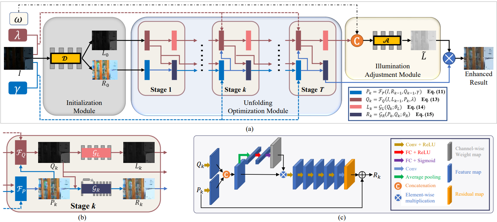

# URetinex-Net: Retinex-based Deep Unfolding Network for Low-light-Image-Enhancement
Official PyTorch implementation of URetinex-Net: Retinex-based Deep Unfolding Network for Low-light-Image-Enhancement in CVPR 2022.




[[Paper]](https://openaccess.thecvf.com/content/CVPR2022/papers/Wu_URetinex-Net_Retinex-Based_Deep_Unfolding_Network_for_Low-Light_Image_Enhancement_CVPR_2022_paper.pdf)
[[Supplementary]](https://openaccess.thecvf.com/content/CVPR2022/supplemental/Wu_URetinex-Net_Retinex-Based_Deep_CVPR_2022_supplemental.pdf)
[[Video]](https://www.youtube.com/watch?v=MJZ5HT1jGrA)
## Requirements
  1. Python == 3.7.6
  2. PyTorch == 1.4.0
  3. torchvision == 0.5.0

## Test

If you only want to process a single image, just run like this (you can specify your image path)
```
python test.py --img_path "./demo/input/img.png"
```

Enhance results will be saved in *./demo/output* if `output_path` is not specified!

# Evaluate

If you want to evaluate using our provided pretrained model, please download the [LOL test datasets](https://daooshee.github.io/BMVC2018website/). And arrange the dataset as *./test_data/LOLdataset/eval15*. Then simply run 
```
python evaluate.py
```

## Citation

If you find our work useful, please cite our paper by the following:
```
@InProceedings{Wu_2022_CVPR,
    author    = {Wu, Wenhui and Weng, Jian and Zhang, Pingping and Wang, Xu and Yang, Wenhan and Jiang, Jianmin},
    title     = {URetinex-Net: Retinex-Based Deep Unfolding Network for Low-Light Image Enhancement},
    booktitle = {Proceedings of the IEEE/CVF Conference on Computer Vision and Pattern Recognition (CVPR)},
    month     = {June},
    year      = {2022},
    pages     = {5901-5910}
}
```
***Noted that the code is only for non-commercial use! should you have any queries, contact me at***  wj1997s@163.com
